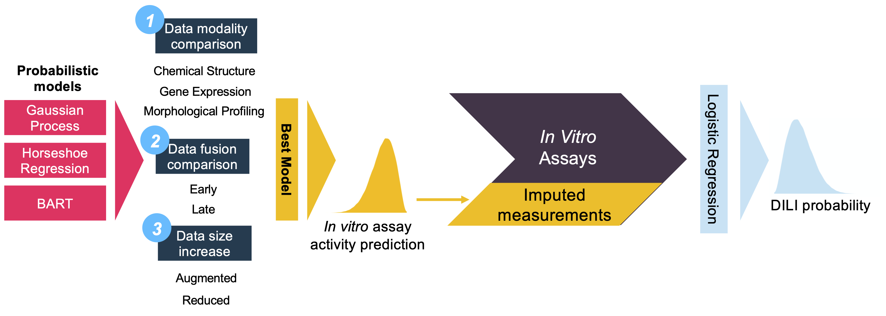

# Predicting in vitro assays related to liver function using probabilistic machine learning
*Authors: Flavio M. Morelli, Marian Raschke, Natalia Jungmann, Michaela Bairlain, Marina García de Lomana*

This repository contains the code used for training, inference, and evaluation of the model presented in the manuscript:

Morelli, F. M., Raschke, M., Jungmann, N., Bairlein, M., & de Lomana, M. G. (2025). Predicting in vitro assays related to liver function using probabilistic machine learning. Toxicology, 154195. [https://doi.org/10.1016/j.tox.2025.154195](https://doi.org/10.1016/j.tox.2025.154195)

**All instructions assume that the working directory is the cloned repo**

## 0. Overview



While machine learning has gained traction in toxicological assessments, the limited data availability requires the quantification of uncertainty of in silico predictions for reliable decision-making. This study addresses the challenge of predicting the outcome of in vitro assays associated with liver function by systematically comparing various probabilistic methods. Our research fills a critical gap by integrating multiple data modalities – chemical descriptors, gene expression, and morphological profiles – into a probabilistic framework aimed at predicting in vitro assays and quantifying uncertainty. We present a comprehensive evaluation of the performance of these data modalities and describe how this framework and the in vitro assay predictions can be integrated to estimate the probability of drug-induced liver injury (DILI) occurrence. Additionally, we contribute new experimental data for reactive oxygen species generation and hepatocyte toxicity assays, providing valuable resources for future research. Our findings underscore the importance of incorporating uncertainty quantification in toxicity predictions, potentially leading to a safer drug development process and reduced reliance on animal testing.


## 1. Conda environment (Linux, CUDA)

We provide a conda environment for Linux with CUDA (x86_64 architecture). Model training can only be conducted in a Linux environment with NVIDIA GPUs.

The conda environment is defined in `dili-predict.yml`. To create and activate a conda environment for training, inference and evaluation run the following commands:
```
conda env create -f dili-predict.yml
conda activate dili-predict
```
To speed up installation you can use [mamba](https://mamba.readthedocs.io/en/latest/index.html) as a drop-in replacement of `conda`.


## 2. Setting the paths

Our codebase keeps track of all the paths in `./dili_predict/path.py`. The root paths may need to be adjusted, but should work out of the box with the data provided. We assume that the data is in `./data_publication` and that the figures will be saved in the respective folder of `./figures`

## 3. Running the experiments

The experiment scripts are in `./notebooks/experiments`. If the experiment script uses a GPU, you need to adjust the GPUs needed `os.environ["CUDA_VISIBLE_DEVICES"]`. BlackJAX, which provides GPU support for the NUTS sampler, assumes that you will have as many GPUs as chains.

Depending on GPU RAM, you may need to adjust the proportion of memory reserved by JAX `os.environ["XLA_PYTHON_CLIENT_MEM_FRACTION"]`. The default is `0.15`.

The main logic of the experiments is defined in `./dili_predict/experiment_runner.py`.

## 4. Running the evaluation scripts

The evaluation scripts that generate the paper's figures is in `./notebooks/figures/`. Predictive checks can be found in `./notebooks/predictive_checks`.

## 5. Data availability

The data used in this study, can be found in `./data_publication`. The datasets `CDDD.csv`, `L1000.csv`, and `CP.csv` contain labels and features to train the models. CDDD features were generated by the authors. L1000 and CP features are taken from [Haghighi et al. (2022)](https://github.com/carpenter-singh-lab/2022_Haghighi_NatureMethods) and we include them in this repository for reproducibility.

The files `ROS_CTX.csv` provides all the newly published data on the `CTX` and `ROS` assays.


## 6. License

The code is distributed under the BSD 3-Clause License, which grants users the freedom to use, modify, and distribute the code with certain obligations and limitations. Please refer to the LICENSE file for detailed information regarding the terms and conditions.